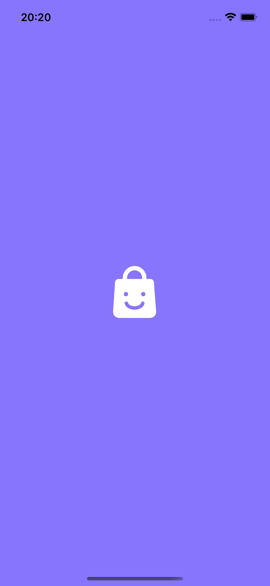
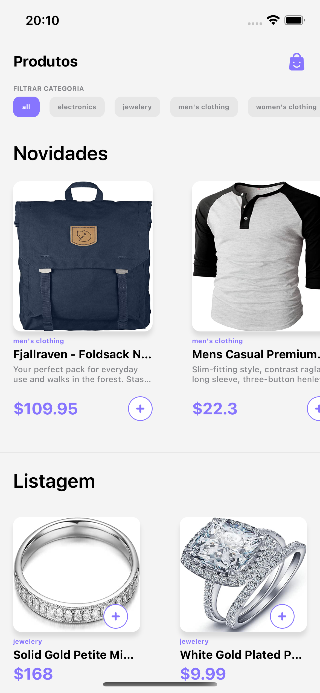
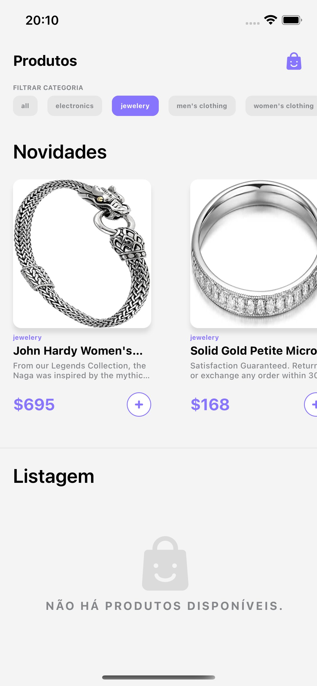
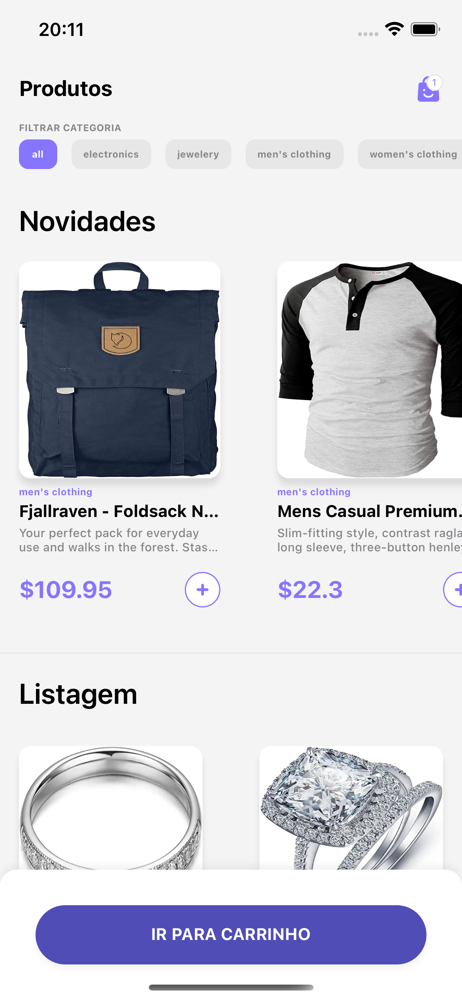
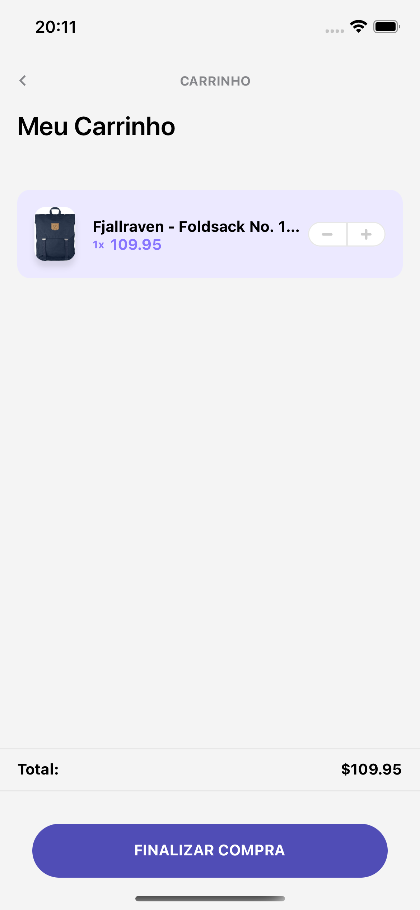
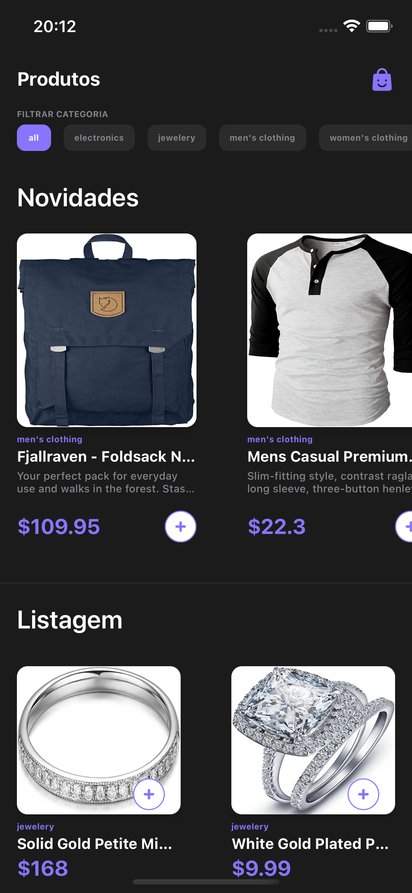
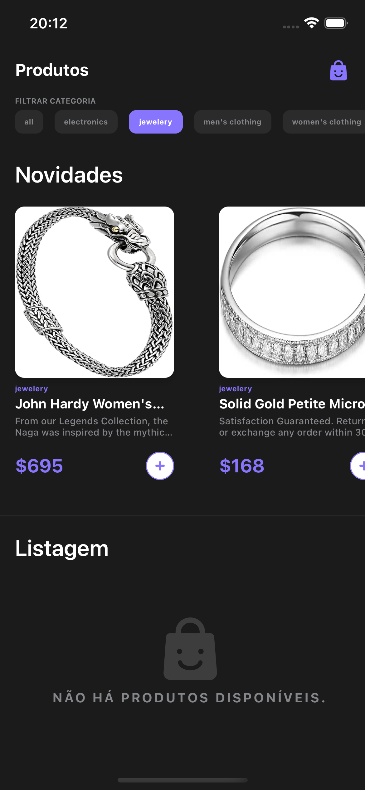
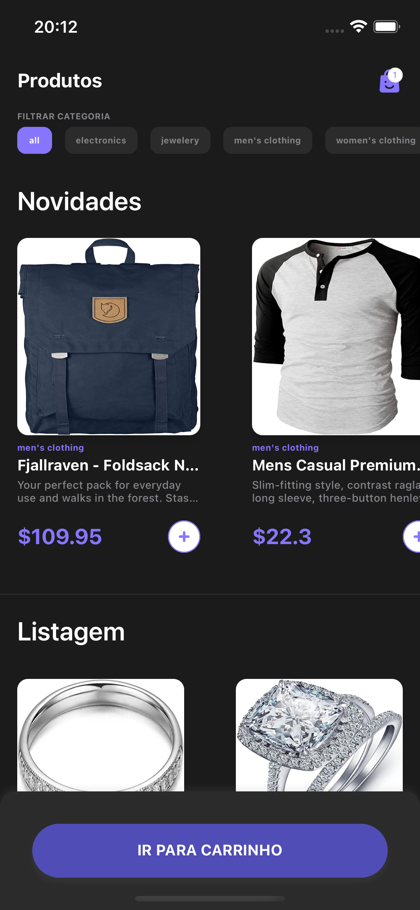
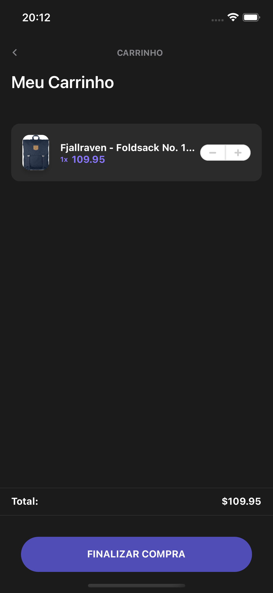
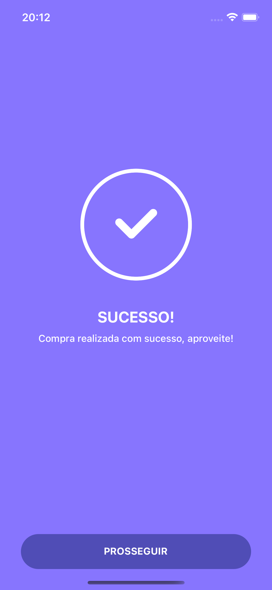

<p align="center">
  <a href="https://felipenascimento.dev">
    
  </a>
</p>

## Projeto

FakeStore é um app de exemplo de vitrine e carrinho de compra de uma loja virtual.

Este projeto utiliza o [React Native](https://reactnative.dev/), [Styled Components](https://styled-components.com/) e [React Navigation](https://reactnavigation.org/).

<p align="center">
  
</p>

<p align="center">
  
  
</p>

<p align="center">
  
  
</p>

<p align="center">
  
  
</p>

<p align="center">
  
  
</p>

<p align="center">
  
</p>

## Instalação

Você precisará ter apenas o [NodeJS](https://nodejs.org) instalado na sua máquina, e após isso, clonar este repositório:

```sh
  $ git clone https://github.com/FelipeNascimentoRJ/fake-store.git
```

Depois disso acesse a pasta do projeto e instale as dependências executando o seguinte comando:

```sh
  $ yarn install # ou npm install
```

## Executando a aplicação

Execute o comando a baixo para inicializar o React Native:

```sh
  $ yarn (ios|android) # ou npm start
```